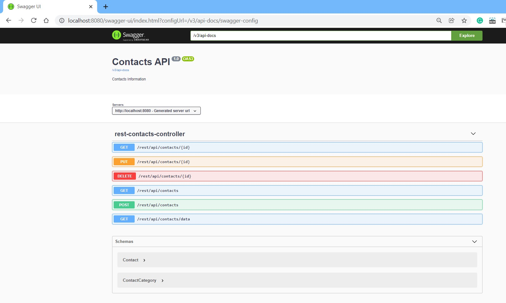

## HOW TO RUN

- The Address Book application is written in layered approach and made it loosely coupled to the layers and objects. <br/>
- This Address book application supports single file or multiple files approach as per configuration we do. <br/>
- The Address book TEXT files are written as JSON format for making it easy to manipulate and maintain. <br/>
- This Application is written with intension of making it flexible and extensible.

Especially, This Application is written in such a way that it can be worked in two ways.

- As a Stand Alone Application By running the main() method in com.mycompany.addressbook.AddressBookApplication class.
- As a REST API using spring boot application. This can be observed by running com.mycompany.addressbook.SpringBootAddressBookApplication class.

The application specific configuration properties are available in application.properties. The application works according to the configuration done.

### Dependencies:

1) It runs without any additional library except jackson JSON library when running as stand alone core java application. <br/>
2) It runs with spring boot web and jackson JSON library when running it as spring boot application. 

### How to run

Run the application as a spring boot application by clicking on run as java application on class : com.mycompany.addressbook.SpringBootAddressBookApplication class.
This application reads the configuration from application.properties file.

### Documentation

Once the application starts, the swagger documentation opens at [Home Page](http://localhost:8080/swagger-ui/index.html?configUrl=/v3/api-docs/swagger-config)  

The sample of how swagger documentation looks can be seen below <br>




### Sample Request and Response JSON

#### POST

URI 

```
http://localhost:8080/rest/api/contacts
```

Request Payload 

```json
{
   "id":1,
   "name":"Nicolas",
   "surname":"Zumb",
   "telephoneNumber":"+352 124560125",
   "email":"nicolas.zumb@@gmail.com",
   "age":"28",
   "hairColour":"Black",
   "contactCategory":{
      "categoryName":"FAMILY"
   }
}

```

#### GET Response

Response Payload 

```json
[
   {
      "id":47888,
      "name":"Nicolas",
      "surname":"Zumb",
      "telephoneNumber":"+352 124560125",
      "email":"nicolas.zumb@@gmail.com",
      "age":28,
      "hairColour":"Black",
      "contactCategory":{
         "categoryName":"FAMILY",
         "categoryProperties":null
      }
   }
]
```

#### TODO:Next steps

- Logging with any one of logging framework.
- JUnit and Integration test cases can be authored.

Thank you
